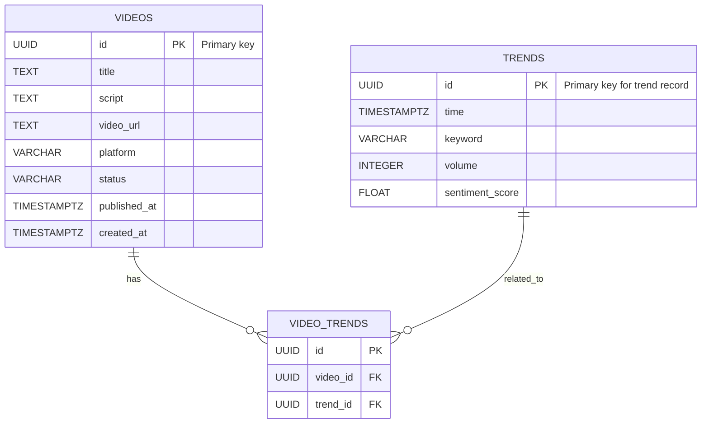

# Project Chimera — Task 1: Deep Research & Architectural Strategy

**Author:** Yordanos Habtamu
**Date:** February 4, 2026
**Role:** Forward‑Deployed Engineer (FDE) Trainee
**Phase:** Task 1 — Strategist Phase

---

## 📘 Task 1.1 — Deep Research & Insights Synthesis

### 1. a16z — *The Trillion Dollar AI Code Stack*

**Core Thesis**
The future value of AI software lies not primarily in better models, but in a full‑stack orchestration layer that bridges developers and AI capabilities. This layer solves the *last‑mile problem*: turning raw AI power into reliable, scalable, and governable systems.

**Key Insights for Project Chimera**

* **Layers of the AI Code Stack**

  * Foundation Models → Orchestration & Tooling → Governance & Observability → Application Layer
  * Chimera should be built *from the orchestration layer downward*, not from the application layer upward.

* **Tooling Over Models**

  * Competitive advantage will come from how agents are equipped with tools, how decisions are traced, and how outputs are governed—not from which LLM is chosen.

* **Infrastructure as Product**

  * The most valuable AI companies will provide *agentic infrastructure*. Chimera is explicitly targeting this layer.

**Takeaway**
Chimera is infrastructure. Its moat is reliable orchestration, observability, and governance for autonomous agents.

---

### 2. OpenClaw — *The Agent Social Network*

**Core Idea**
Agents will form networks with standardized protocols for discovery, delegation, and status broadcasting.

**Implications for Chimera**

* Design Chimera as a discoverable **ContentProducer** agent.
* Subscribe to **TrendAnalyst** feeds.
* Announce outputs and state changes to **Distribution** agents.

**Takeaway**
Agent discovery, task delegation, and status broadcasting must be first‑class features.

---

### 3. MoltBook — *Social Media for Bots*

**Core Idea**
Bot‑native social platforms require structured, machine‑readable protocols, verifiable identity, and reputation systems.

**Implications for Chimera**

* Verifiable agent identities
* Reputation tracking
* Provenance metadata for all generated content

**Takeaway**
Ethical guardrails, transparency, and accountability must be embedded from day one.

---

### 4. Project Chimera SRS — Spec‑Driven Architecture

**Core Idea**
Specifications are the primary contract. MCP (Model Context Protocol) acts as the audit and observability backbone.

**Design Principles**

* Spec‑Driven Development (SDD): no code without a spec
* MCP as an audit and observability layer
* Clear separation of reusable **Skills** vs external **Tools** (accessed via MCP)
* Human‑in‑the‑Loop (HITL) for safety and compliance

---

## 🧠 Strategic Synthesis

* Chimera publishes a service descriptor
* Subscribes to external trend feeds
* Requests human moderation when required
* Surfaces provenance, reputation, and audit data at every stage

---

## 🏗️ Task 1.2 — Architectural Approach

### Selected Pattern: Hierarchical Swarm with Supervisor Orchestration

**Rationale**
Sequential chains are brittle, and monoliths are hard to govern. A hierarchical swarm provides modularity, resilience, and independent scaling.

**High‑Level Agent Hierarchy**

* **SupervisorAgent**

  * **ResearchSwarm**

    * TrendFetcherAgent
    * NicheAnalystAgent
  * **ContentSwarm**

    * ScriptWriterAgent
    * VideoGeneratorAgent
    * ThumbnailDesignerAgent
  * **SafetyLayer**

    * Human‑in‑the‑Loop (HITL)
  * **DistributionSwarm**

    * PlatformPublisherAgent
    * OpenClawAnnouncerAgent

---

## 🗄️ Infrastructure Decisions

### 1. Database — PostgreSQL + TimescaleDB

**Why SQL**

* Strong transactional guarantees
* Rich relational modeling for metadata
* Time‑series analysis via TimescaleDB for trends, audits, and engagement metrics

### Database Schema (ER Diagram)



### SQL Preview (Adapted)

```sql
-- Videos table
CREATE TABLE videos (
    id UUID PRIMARY KEY,
    title TEXT NOT NULL,
    script TEXT,
    video_url TEXT,
    platform VARCHAR(50),
    status VARCHAR(20), -- 'draft', 'approved', 'published'
    published_at TIMESTAMPTZ,
    created_at TIMESTAMPTZ DEFAULT NOW()
);

-- Trends table (time-series)
CREATE TABLE trends (
    id UUID PRIMARY KEY DEFAULT gen_random_uuid(),
    time TIMESTAMPTZ NOT NULL,
    keyword VARCHAR(100) NOT NULL,
    volume INTEGER,
    sentiment_score FLOAT
);
SELECT create_hypertable('trends', 'time');

-- Join table linking videos to trends
CREATE TABLE video_trends (
    id UUID PRIMARY KEY DEFAULT gen_random_uuid(),
    video_id UUID REFERENCES videos(id) ON DELETE CASCADE,
    trend_id UUID REFERENCES trends(id) ON DELETE CASCADE
);
```

---

### 2. Human‑in‑the‑Loop (HITL) Design

**Approval Triggers**

* First post to a new platform
* Content flagged by classifiers
* Engagement spikes beyond thresholds
* Schedule deviations

**Implementation Notes**

* Webhook to a FastAPI‑based human review dashboard
* Content is held if no response is received within a defined timeout

---

### 3. MCP Strategy

* **Development:** git‑mcp, filesystem‑mcp, docker‑mcp
* **Runtime:** database‑mcp, openclaw‑mcp, platform‑apis‑mcp

---

### 4. Environment & Deployment

* Local development: Docker + Docker Compose
* Orchestration‑ready: Kubernetes manifests prepared for later stages
* Observability: Prometheus + Grafana

---

## 📌 Task 1.3 — Environment Checklist

* Repository initialized
* `pyproject.toml` configured with `uv`
* Tenx MCP Sense connected and logging to `logs/mcp_trace.json`
* Python 3.11 virtual environment
* Initial spec‑driven commit completed
