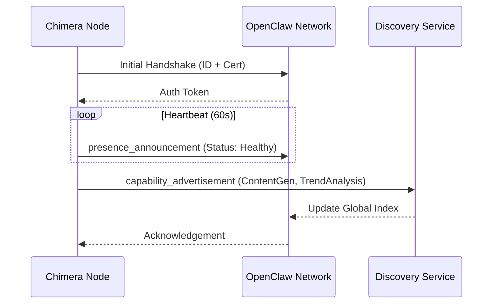

# OpenClaw Network Integration Specification

## Overview

Project Chimera will integrate with the OpenClaw network to broadcast its availability, capabilities, and status information. This integration enables Chimera to participate in the distributed AI agent ecosystem and share resources with other network participants.

## Network Participation Goals

### Primary Objectives
1. **Resource Sharing**: Advertise available content creation capabilities to other network agents
2. **Status Broadcasting**: Regularly publish system health and availability information
3. **Capability Discovery**: Allow other agents to discover and utilize Chimera's specialized functions
4. **Network Coordination**: Participate in network-wide task distribution and load balancing

### Secondary Benefits
1. **Redundancy**: Provide backup content creation services for network partners
2. **Collaboration**: Enable joint projects with other AI agents in the network
3. **Metrics Sharing**: Contribute performance data for network-wide analytics
4. **Protocol Evolution**: Participate in OpenClaw protocol development and improvements

## Integration Architecture

### Communication Layer
```
Chimera Core System
    ↓
OpenClaw Integration Module
    ↓
OpenClaw Protocol Handler
    ↓
Network Transport Layer (WebSocket/HTTP)
    ↓
OpenClaw Network Infrastructure
```

### Key Components

**OpenClawAnnouncerAgent**: Specialized agent responsible for all network communications
- Handles protocol compliance and message formatting
- Manages connection lifecycle and reconnection logic
- Processes incoming network requests and queries
- Maintains network presence and availability status

**Protocol Adapter**: Translates internal Chimera data structures to OpenClaw formats
- Converts agent capabilities to network-standard representations
- Maps internal status codes to network-compatible formats
- Handles data serialization and deserialization

**Security Manager**: Ensures secure network communications
- Implements network authentication and authorization
- Manages certificate-based identity verification
- Handles encrypted message transmission

## Message Types and Formats

### Presence Announcement
Sent every 60 seconds to maintain network presence:

```json
{
  "message_type": "presence_announcement",
  "agent_id": "chimera_supervisor_001",
  "network_id": "chimera_main_instance",
  "timestamp": "ISO8601 timestamp",
  "capabilities": {
    "content_generation": {
      "types": ["video", "script", "thumbnail"],
      "supported_platforms": ["youtube", "twitter", "instagram", "tiktok"],
      "max_concurrent_jobs": 50,
      "average_processing_time": "30s"
    },
    "research_capabilities": {
      "trend_analysis": true,
      "niche_identification": true,
      "competitor_analysis": true,
      "data_sources": ["google_trends", "social_media_apis", "news_feeds"]
    },
    "safety_features": {
      "automated_moderation": true,
      "human_review_available": true,
      "policy_compliance": ["youtube", "twitter", "instagram"]
    }
  },
  "current_status": {
    "overall_health": "healthy",
    "available_capacity": 85,
    "active_jobs": 12,
    "queue_length": 3,
    "last_maintenance": "ISO8601 timestamp"
  }
}
```

### Capability Advertisement
Broadcast when capabilities change or upon network request:

```json
{
  "message_type": "capability_advertisement",
  "agent_id": "chimera_network_node",
  "advertisement_id": "UUID",
  "valid_from": "ISO8601 timestamp",
  "valid_until": "ISO8601 timestamp",
  "services_offered": [
    {
      "service_type": "content_generation",
      "sub_type": "video_script_writing",
      "parameters": {
        "input_formats": ["research_data", "topic_brief", "outline"],
        "output_formats": ["formatted_script", "storyboard", "timing_guide"],
        "quality_levels": ["standard", "premium", "enterprise"]
      },
      "performance_metrics": {
        "avg_completion_time": "45s",
        "success_rate": 0.97,
        "resource_utilization": 0.65
      }
    },
    {
      "service_type": "trend_analysis",
      "sub_type": "niche_research",
      "parameters": {
        "analysis_depth": ["surface", "deep", "comprehensive"],
        "time_ranges": ["7d", "30d", "90d"],
        "output_formats": ["json_report", "visual_charts", "recommendation_list"]
      }
    }
  ]
}
```

### Status Updates
Sent for significant state changes:

```json
{
  "message_type": "status_update",
  "agent_id": "chimera_instance",
  "update_id": "UUID",
  "timestamp": "ISO8601 timestamp",
  "status_type": "enum(maintenance|incident|capacity_change|capability_update)",
  "severity": "enum(info|warning|critical)",
  "details": {
    "previous_state": "operational",
    "current_state": "maintenance_mode",
    "expected_duration": "2 hours",
    "affected_services": ["content_generation", "trend_analysis"],
    "mitigation": "Redirecting requests to backup instances"
  },
  "contact_info": {
    "admin_email": "admin@chimera.network",
    "support_channel": "openclaw_chimera_support",
    "estimated_resolution": "ISO8601 timestamp"
  }
}
```

## Network Protocol Implementation

### Connection Management
- **Initial Handshake**: Establish identity and capabilities with network coordinator
- **Heartbeat Protocol**: Maintain connection with periodic presence signals
- **Graceful Disconnection**: Proper cleanup and status notification before shutdown
- **Error Recovery**: Automatic reconnection with exponential backoff

### Data Exchange Patterns
- **Publish-Subscribe**: Broadcast announcements to interested network participants
- **Request-Response**: Handle direct queries about capabilities and status
- **Event Streaming**: Continuous flow of status updates and performance metrics
- **Batch Processing**: Periodic reporting of aggregated statistics

### Security Considerations


### Security Considerations
- **Identity Verification**: Certificate-based authentication with network authorities
- **Message Integrity**: Digital signatures for all outbound communications
- **Privacy Protection**: Anonymization of sensitive operational data
- **Rate Limiting**: Prevent network spam and abuse

## Integration Workflow

### Startup Sequence
1. Initialize OpenClaw integration module
2. Register with network discovery service
3. Broadcast initial capability advertisement
4. Begin regular presence announcements
5. Subscribe to relevant network event streams

### Runtime Operations
1. Monitor internal system status continuously
2. Translate status changes to network-compatible formats
3. Send timely status updates for significant events
4. Respond to network queries about capabilities
5. Participate in network coordination activities

### Shutdown Procedure
1. Broadcast maintenance/offline status
2. Complete pending network communications
3. Gracefully disconnect from network services
4. Preserve session state for quick restart
5. Log disconnection events for audit purposes

## Monitoring and Metrics

### Network Performance Metrics
- Message delivery success rate
- Average response time to network queries
- Connection uptime and stability
- Bandwidth utilization for network communications

### Integration Health Indicators
- Successful registration with network services
- Regular presence announcement delivery
- Proper handling of network protocol messages
- Timely status update propagation

### Alerting Thresholds
- Failed presence announcements > 3 consecutive attempts
- Network connection downtime > 5 minutes
- Message processing delays > 30 seconds
- Authentication failures > 5 occurrences

## Future Enhancements

### Phase 2 Features
- **Task Delegation**: Accept content creation requests from other network agents
- **Resource Pooling**: Share computational resources during peak demand
- **Collaborative Workflows**: Joint content creation with other AI agents
- **Advanced Analytics**: Contribute detailed performance data to network intelligence

### Long-term Vision
- **Protocol Leadership**: Help evolve OpenClaw standards and best practices
- **Ecosystem Growth**: Facilitate new agent onboarding and integration
- **Cross-network Federation**: Connect with other AI agent networks
- **Autonomous Coordination**: Self-organizing network participation without human intervention

This specification ensures Project Chimera can effectively participate in the OpenClaw network while maintaining security, reliability, and valuable resource sharing capabilities.